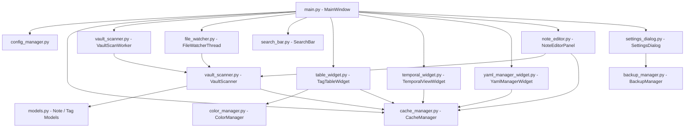

# Codebase Architecture Map: Obsidian Vault Editor

A high-level architectural index and structural map for `Obsidian_Vault_Editor`. Consult this document to quickly locate modules, trace dependencies, and understand component contracts.

---

## Core Architecture & Modules

The application is a native **PyQt6 desktop client** that indexes, visualizes, and edits Markdown notes and tags within an Obsidian vault using an embedded **SQLite3 caching engine** and **Watchdog filesystem listener**.

| Module | Location | Primary Responsibility |
| :--- | :--- | :--- |
| **Main Window / Entry** | `main.py` | Top-level PyQt6 application shell (`MainWindow`, `main()`). Orchestrates the tab widget, search bar, menus, status bar, async scanner worker, and live file watcher. |
| **Data Models** | `models.py` | Core dataclasses (`Note`, `Tag`, `SharedTag`, `TagStats`, `VaultInfo`) representing structural data contracts passed across UI and storage layers. |
| **Cache Engine** | `cache_manager.py` | SQLite database manager (`CacheManager` -> `~/.obsidian-tag-viewer/cache.db`). Handles full vault indexing, incremental file updates, tag co-occurrence matrices (`shared_tags`), tag statistics, and timeline/YAML queries. |
| **Vault Scanner** | `vault_scanner.py` | Markdown & YAML parser (`VaultScanner`) and background scanner (`VaultScanWorker` QThread). Extracts YAML frontmatter (`tags`, `created`, `status`, `bucket`, `attention`, etc.) and body inline `#tags`. |
| **File Watcher** | `file_watcher.py` | Real-time filesystem observer (`FileWatcherThread` QThread using `watchdog`). Debounces `.md` create/modify/delete events and triggers incremental database updates. |
| **Tag Tree View** | `table_widget.py` | Hierarchical tag viewer (`TagTableWidget` / `QTreeWidget`). Lazy-loads notes under tags, displays tag counts, co-occurring shared tags, color icons, multi-note selection, right-click context menus for batch tag additions/removals, floating autocomplete tag dialog (`AddTagDialog`), and instant YAML frontmatter sync. |
| **Note Editor Panel** | `note_editor.py` | Embedded markdown note editor (`NoteEditorPanel`). Features frontmatter header controls, tag autocompletion, batch YAML cleanup actions, and saving triggers. |
| **Temporal Explorer** | `temporal_widget.py` | Timeline visualization view (`TemporalViewWidget`). Displays chronologically ordered notes, tag creation activity, and date range filters. |
| **Bulk YAML Manager** | `yaml_manager_widget.py` | Bulk metadata manager panel (`YamlManagerWidget`). Provides table views of note YAML headers, filtering by status/bucket/date, and batch metadata fixing. |
| **Search Bar** | `search_bar.py` | Debounced text search input (`SearchBar`) with clear button and real-time query signals. |
| **Color Manager** | `color_manager.py` | Deterministic color hashing (`ColorManager`). Generates consistent HSL/RGB colors and `QIcon` color dots for visual tag identification. |
| **Config Manager** | `config_manager.py` | User preferences manager (`ConfigManager` -> `~/.obsidian-tag-viewer/config.json`). Manages vault path, window geometry, backup settings, and themes. |
| **Settings Dialog** | `settings_dialog.py` | Preferences modal (`SettingsDialog`). Configures vault location, backup destination, maximum backups, and backup triggers. |
| **Backup Manager** | `backup_manager.py` | Vault archiver (`BackupManager`). Handles automated `.zip` vault backups and backup retention cleanup. |

---

## Dependency & Data Flow

```text
[Disk Filesystem / Obsidian Vault]
          ▲                │
          │ (write notes)  ▼ (watchdog live events)
   [NoteEditorPanel]  [FileWatcherThread]
          │                │
          ▼                ▼
     [main.py: MainWindow] ◄─── (incremental / full scan) ─── [VaultScanWorker QThread]
     │    │            │                                            │
     │    │            └──► [VaultScanner] ─────────────────────────┘
     │    │                        │ (returns Note model)
     │    ▼                        ▼
     │  [CacheManager (SQLite)] ◄──┘
     │          │
     ├──────────┼────────────────────────┬────────────────────────┐
     ▼          ▼                        ▼                        ▼
[SearchBar] [TagTableWidget]   [TemporalViewWidget]   [YamlManagerWidget]
  (filter)   (Tag Tree View)   (Timeline Explorer)    (Bulk Metadata View)
```

### Data Flow Summaries:
1. **Startup & Vault Scanning**: `main.py` -> starts `VaultScanWorker` (runs `VaultScanner.scan_file` on disk `.md` files) -> outputs `Note` models -> updates `CacheManager` (SQLite `cache.db`) -> reloads UI panels.
2. **Live File Watching**: `FileWatcherThread` detects changes on disk -> emits signal to `main._on_file_changed` -> calls `VaultScanner.scan_file` -> updates `CacheManager.incremental_update_file` -> refreshes active UI tab.
3. **User Search & Filtering**: User types in `SearchBar` -> emits `search_changed` -> `TagTableWidget.reload_tags` / `YamlManagerWidget` queries `CacheManager` with filter string -> UI updates instantaneously.
4. **Note Editing & Saving**: Double-clicking note in `TagTableWidget` -> opens `NoteEditorPanel` -> user saves -> writes raw file to disk -> calls `VaultScanner.scan_file` -> updates `CacheManager` -> flashes UI green confirmation.

---

## Key Entry Points & APIs

### 1. Main Entry Point
- File: [main.py](file:///d:/__AI2/Obsidian_Vault_Editor/main.py)
- Class: `MainWindow(QMainWindow)`
- Command: `python main.py`

### 2. Core Data Contracts (`models.py`)
- `Note`: Dataclass representing a parsed Markdown file (`path`, `title`, `modified_at`, `created_at`, `tags`, `bucket`, `status`, `attention`, `daily_note`, `author`, `url`, `extra_metadata`).
- `Tag`: Dataclass representing a tag entity (`name`, `count`, `color`).
- `TagStats`: Aggregate statistics for vault tags and note counts.

### 3. Primary Data Access APIs (`cache_manager.py`)
- `full_scan_update(notes_list: List[Note]) -> bool`: Atomically wipes and replaces all SQLite tables (`files`, `tags`, `file_tags`, `shared_tags`).
- `incremental_update_file(note: Optional[Note], is_delete=False) -> bool`: Updates or deletes a single note and recalculates tag counts.
- `get_all_tags(sort_by, filter_query, ...) -> List[dict]`: Queries tag list sorted by count, alphabetical, or modification date.
- `get_notes_for_tag(tag_name, filter_query) -> List[dict]`: Returns notes tagged with `tag_name` and their co-occurring shared tags.

### 4. Scanner APIs (`vault_scanner.py`)
- `VaultScanner.scan_file(abs_path: Path, vault_root: Path) -> Optional[Note]`: Parses a single `.md` file for frontmatter metadata and body `#tags`.
- `VaultScanWorker(QThread)`: Async thread emitting `progress(current, total, filename)` and `finished(notes_list)`.

---

## Component Architecture Graph

