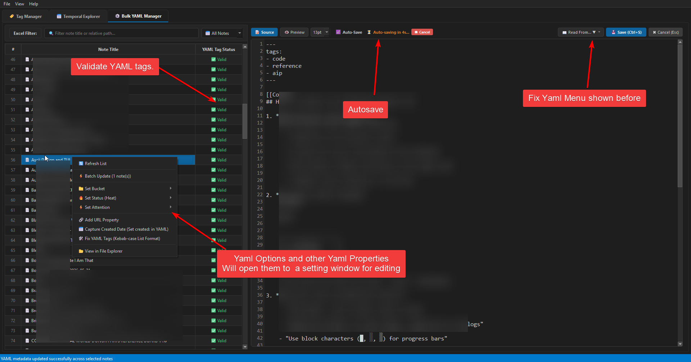
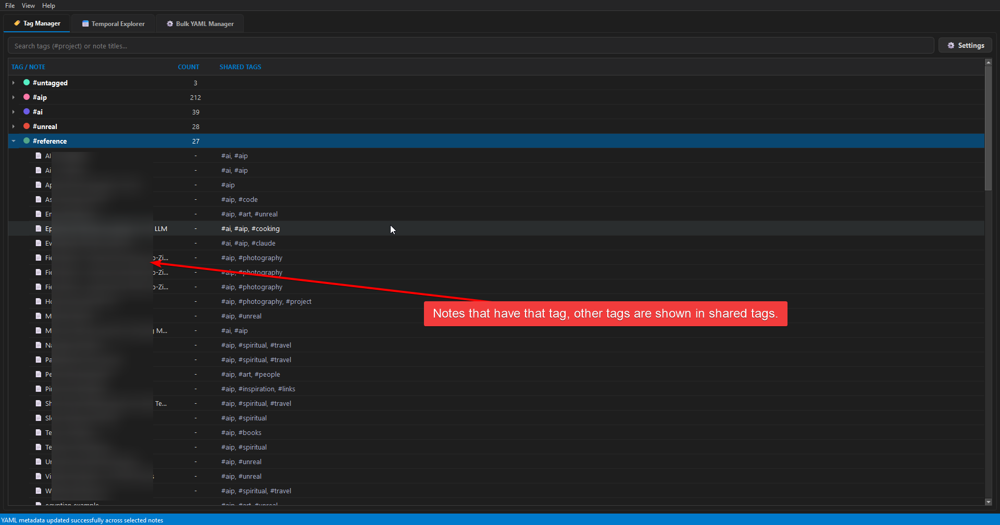
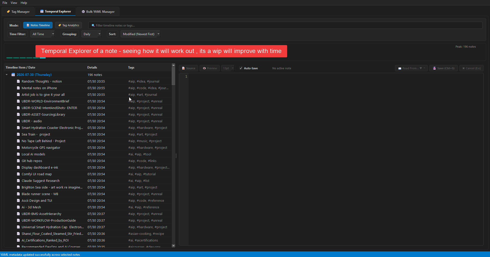
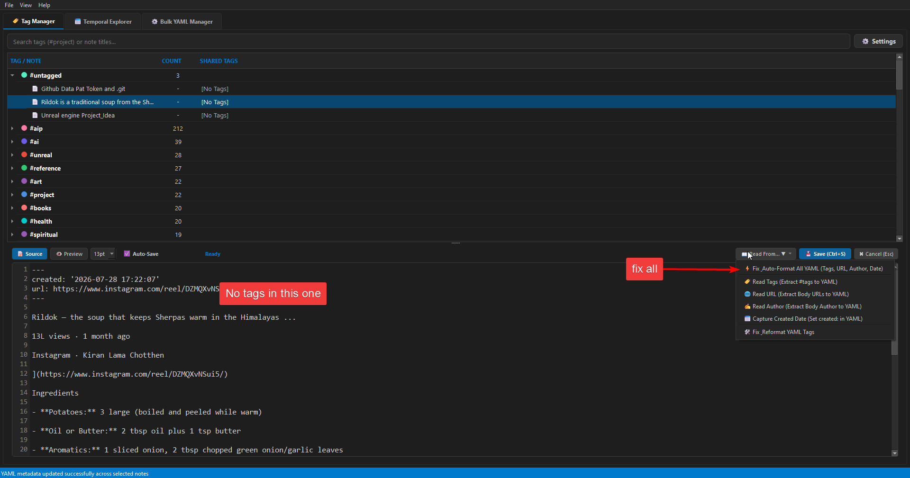
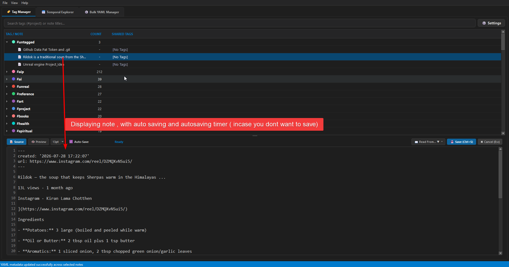
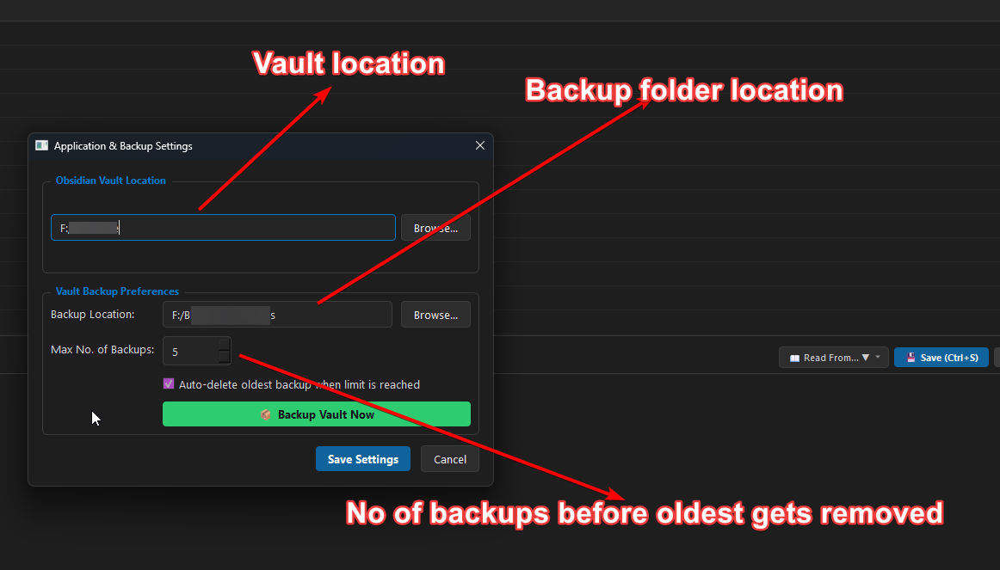

# Obsidian Tag Viewer & Editor 💎

A high-performance, native Python (**PyQt6**) desktop application for viewing, searching, inspecting, and editing tags and Markdown notes across your Obsidian vaults in real time.

---

## 📸 Application Screenshots

*(Click any screenshot preview below to open full resolution image)*

<div align="center">
  <a href="ScreenShots/python_KCpbGcKorc.png" target="_blank">
    
  </a>
  <a href="ScreenShots/python_kgZOz8HJus.png" target="_blank">
    
  </a>
</div>

<br/>

<div align="center">
  <a href="ScreenShots/python_ZV0VQ4Hjky.png" target="_blank">
    
  </a>
  <a href="ScreenShots/python_zrJxlOjeS6.png" target="_blank">
    
  </a>
</div>

<br/>

<div align="center">
  <a href="ScreenShots/python_RYu3xkclQr.png" target="_blank">
    
  </a>
  <a href="ScreenShots/python_y6opiZUvzo.png" target="_blank">
    
  </a>
</div>

---

## 🌟 Core Features

- **🏷️ Interactive Batch Tag Manager**:
  - **Multi-Selection**: Select single or multiple notes (`Shift` / `Ctrl`) across tag groups.
  - **Right-Click Context Menus**: Add or remove specific tags, clear all tags, or remove parent tags in bulk.
  - **Floating Tag Autocomplete Dialog**: Floating popup window with auto-completion across all existing vault tags.
  - **Instant YAML Sync**: Reads and updates `tags:` frontmatter headers and body hashtags on disk, instantly syncing SQLite cache.
- **⚡ Fast Vault Scanner**: Asynchronous non-blocking `VaultScanWorker` QThread scanner parsing YAML frontmatter tags (strings & lists) and inline `#tags` while skipping code blocks (` ``` `). Supports nested tags (e.g. `#project/active`).
- **💾 SQLite Local Cache**: Stores files, tags, and a materialized co-occurrence `shared_tags` matrix at `~/.obsidian-tag-viewer/cache.db` with indexes for handling 50,000+ notes smoothly.
- **📊 Expandable Tree Layout**: Top-level tag rows sorted by note count with deterministic color dot indicators; expanding a tag displays child notes with co-occurring shared tags (e.g., `#meeting, #todo/high`).
- **📅 Temporal Explorer**: Visual timeline explorer for tracking note creation and tag activity over time.
- **⚙️ Bulk YAML Manager**: Spreadsheet-style table view for filtering, inspecting, and batch-fixing note YAML headers.
- **🔍 Debounced Search Bar**: Real-time filtering across tag names and note titles with debouncing (300ms) and Escape reset.
- **📝 Full-Width Inline Note Editor**: Monospace code editor (`Consolas` / `Fira Code`) with line numbers, 4-space tab indentation, `[SAVE]` / `[CANCEL]` toolbar, `Ctrl+S` shortcut, and green row flash confirmation on save.
- **👀 Background File Watcher**: Automatic real-time filesystem monitoring via `watchdog` with 500ms debouncing for instant incremental cache updates without UI freezing.
- **📊 Statistics & CSV Export**: Detailed tag statistics popup and full view export to CSV.

---

## 🚀 Setup & Installation

### Prerequisites
- Python 3.11 or higher.

### 1. Install Dependencies
```bash
pip install -r requirements.txt
```

### 2. Run Application
```bash
python main.py
```

---

## 📦 Distribution Packaging (PyInstaller)

To build a single-file standalone executable for Windows / macOS / Linux:

```bash
pyinstaller --noconsole --onefile --name "ObsidianTagViewer" main.py
```

The compiled binary will be placed inside the `dist/` directory.
